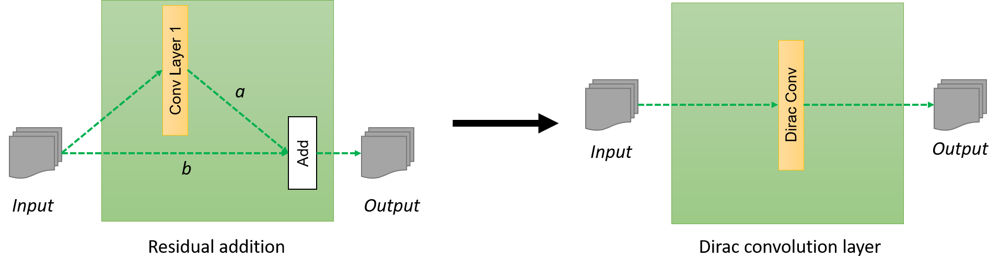

This is the tensorflow implementaion of the Dirac Networks defined in [paper](https://arxiv.org/pdf/1706.00388.pdf) by Sergey et al.

We have implemented the model for both the Cifar-10 dataset([Link](https://www.cs.toronto.edu/~kriz/cifar.html)) and the Imagenet([Link](http://www.image-net.org/)) Dataset. Although, we have not yet tested the model for Imagenet classification due to resource constraints.

At the core, main objective of the paper can be seen to generalize residual networks in form a traditional convoltion networks, so bascially we will try to encapsulate the extra step of adding the input to the output into a convolution layer.

For that we will define a new/modified convolution function named **dirac_conv2d** defined in [layers/dirac_layers.py](https://github.com/hardikbansal/General-DL-code-Tensorflow/blob/master/layers/dirac_layers.py)

What Dirac Networks essentially does is the following step:

<p align="center">

</p>

For this readme we will use Filter Matrix and Convolution Matrix interchangably. Basically it is the weight matrix that we use in convolution layer and pass it over the input image extract features. To understand convolution layer in detail one can read this blog by [ujjwarlkarn](https://ujjwalkarn.me/2016/08/11/intuitive-explanation-convnets/).

Suppose, we have a convolution matrix **conv_matrix_I** in a convolution layer, such that the output is same as the input, that is the convolution layer act as the identitiy matrix, then the filter/convolution matrix in new dirac convolution layer will be **a\*conv_matrix + b\*conv_matrix_I**. Such that the new output of the convolution is **a** times the normal output of convolution layer + **b** times the original input image, i.e. adding the input as a residue to the output of a normal convolution layer. Here, **a** and **b** are also paramenters to be learned.

*Note: Here conv_matrix_I is not a parameter to be learned, Rather it is a fixed matrix*

The dirac convolution layer can be used in any model as follow:

`dirac_conv2d(o_loop, outdim, filter_height=3, filter_width=3, stride_height=1, stride_width=1, name)`


Apart from **dirac_conv2d**, we have also defined the **dirac_intitalizer** that according to author is a better initialization technique when we wants to carry the input image information into deeper layers. So, one can directly initialize use it as follow while initializing the convolution matrix.

`conv_matrix = tf.get_variable("weight",[filter_height, filter_width, input_dim, output_dim], initializer=tf.truncated_normal_initializer(stddev=stddev))`


In the file [models/Diracnet/diracnet.py](https://github.com/hardikbansal/General-DL-code-Tensorflow/blob/master/models/Diracnet/diracnet.py), we have implemented the model(defined in [paper](https://arxiv.org/pdf/1706.00388.pdf)) for Cifar-10 and Imagenet dataset.

Model for Cifar-10 can be described by the following image:

**Add image of the model over here**

To run this model, run the following commands:

```bash

git clone https://github.com/hardikbansal/General-DL-code-Tensorflow
cd General-DL-code-Tensorflow
python models/Diracnet/diracnet.py 

```

It will automatically download the Cifar-10 dataset and start running the model.
